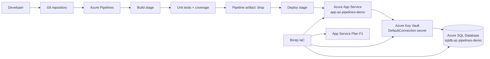
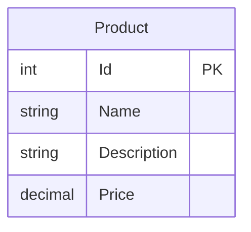
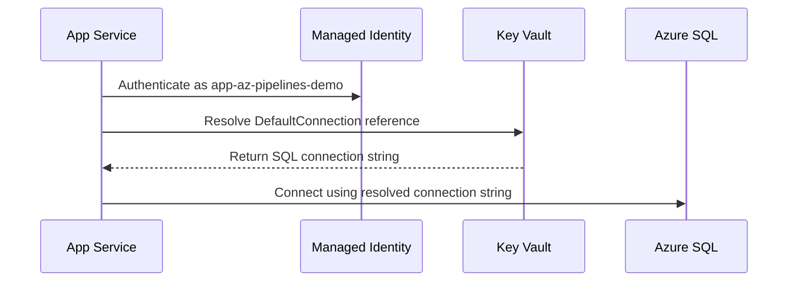
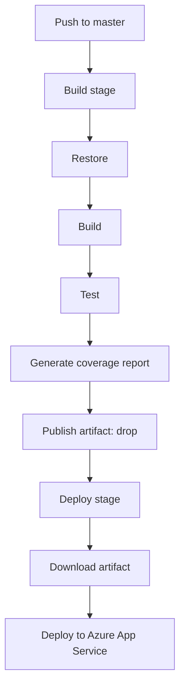

# Azure Pipelines Demo


Professional demo of a .NET 10 ASP.NET Core MVC application deployed with Azure Pipelines, Azure App Service, Azure SQL Database, Azure Key Vault, and Bicep.

The app includes a small Products CRUD feature backed by SQL Server. The infrastructure is intentionally small and inexpensive for learning: App Service uses the `F1` Free tier, while Azure SQL uses the Basic DTU tier.

## Architecture



## What This Demonstrates

- ASP.NET Core MVC on `.NET 10`
- Products CRUD with Entity Framework Core and SQL Server
- EF Core migrations applied automatically at startup
- Azure Pipelines build, test, code coverage, artifact publishing, and deployment
- Azure App Service on Linux
- Bicep infrastructure-as-code
- Azure Key Vault references for production-style secret management
- App Service environment variables managed from a separate Bicep module
- Low-cost demo resource configuration and cleanup commands

## Repository Structure

```text
.
├── azure-pipelines.yml          # Build/test/coverage/deploy pipeline
├── Dockerfile                   # Optional container build for .NET 10
├── global.json                  # Pins .NET SDK 10.0.203
├── infra/
│   ├── main.bicep               # Azure resources: App Service, SQL, Key Vault
│   └── app-settings.bicep       # App Service environment variables
├── src/
│   ├── Controllers/             # MVC controllers
│   ├── Data/                    # EF Core DbContext
│   ├── Migrations/              # EF Core migrations
│   ├── Models/                  # Product and error models
│   └── Views/                   # Razor views
└── tests/
    └── AzPipelinesDemo.Tests/   # xUnit tests
```

## Local Development

Prerequisites:

- .NET SDK 10
- SQL Server LocalDB or SQL Server Express
- Optional: Azure CLI for cloud deployment

Check installed SDKs:

```powershell
dotnet --list-sdks
```

Restore, build, test, and run:

```powershell
dotnet restore tests/AzPipelinesDemo.Tests/AzPipelinesDemo.Tests.csproj
dotnet build tests/AzPipelinesDemo.Tests/AzPipelinesDemo.Tests.csproj --configuration Release
dotnet test tests/AzPipelinesDemo.Tests/AzPipelinesDemo.Tests.csproj --configuration Release --no-build
dotnet run --project src/AzPipelinesDemo.csproj
```

Open the local URL printed by `dotnet run`, then browse to:

```text
/Products
```

The development connection string is stored in `src/appsettings.Development.json`. The app applies EF Core migrations automatically on startup.

## Database And Migrations

The Products feature uses Entity Framework Core with SQL Server.



Add a future migration after changing the model:

```powershell
dotnet tool install --global dotnet-ef
dotnet ef migrations add MigrationName --project src/AzPipelinesDemo.csproj
```

Apply migrations manually if needed:

```powershell
dotnet ef database update --project src/AzPipelinesDemo.csproj
```

## Azure Infrastructure

Bicep creates these resources in `rg-az-pipelines-demo`:

| Resource | Name | Purpose |
| --- | --- | --- |
| App Service Plan | `asp-az-pipelines-demo` | Linux hosting plan, `F1` Free tier |
| Web App | `app-az-pipelines-demo` | Runs the ASP.NET Core MVC app |
| Azure SQL Server | `sql-az-pipelines-demo-*` | Hosts the SQL database |
| Azure SQL Database | `sqldb-az-pipelines-demo` | Stores Product data |
| Key Vault | `kv-*` | Stores the SQL connection string secret |

Provision or update infrastructure:

```powershell
az login
az account set --subscription "<subscription-name-or-id>"

az group create `
  --name rg-az-pipelines-demo `
  --location southeastasia

az deployment group create `
  --resource-group rg-az-pipelines-demo `
  --template-file infra/main.bicep `
  --parameters sqlAdministratorPassword="<your-strong-password>"
```

You must pass `sqlAdministratorPassword` when running a full Bicep deployment because it is a required secure parameter. Do not commit real passwords to the repository.

## Secrets And Configuration

The production connection string is not stored directly in App Service settings. Bicep stores it in Key Vault as a secret named:

```text
DefaultConnection
```

The Web App uses a system-assigned managed identity with `get` and `list` secret permissions. App Service then resolves the connection string through a Key Vault reference.



Application settings are managed in:

```text
infra/app-settings.bicep
```

Current settings:

```bicep
ASPNETCORE_ENVIRONMENT: 'Production'
FeatureFlags__Products: 'true'
```

ASP.NET Core reads `FeatureFlags__Products` as:

```text
FeatureFlags:Products
```

The Products menu item is shown only when this flag is enabled.

Quickly toggle the Products feature in Azure without a full Bicep deployment:

```powershell
az webapp config appsettings set `
  --resource-group rg-az-pipelines-demo `
  --name app-az-pipelines-demo `
  --settings FeatureFlags__Products=false

az webapp restart `
  --resource-group rg-az-pipelines-demo `
  --name app-az-pipelines-demo
```

Remember: the next full Bicep deployment will reset the value to whatever is defined in `infra/app-settings.bicep`.

## Azure Pipelines

The pipeline has two stages:



The deploy task uses the service connection named:

```text
sc-az-pipelines-demo
```

Create it in Azure DevOps:

```text
Project settings -> Service connections -> New service connection
Azure Resource Manager -> Workload identity federation
```

Grant the service principal `Contributor` on the resource group:

```powershell
az role assignment create `
  --assignee-object-id "<service-principal-object-id>" `
  --assignee-principal-type ServicePrincipal `
  --role Contributor `
  --resource-group rg-az-pipelines-demo
```

The role assignment lets the pipeline find and deploy to the Web App, but it does not allow the service principal to grant Azure RBAC permissions to others.

## Useful Azure Commands

Show the Web App URL:

```powershell
az webapp show `
  --resource-group rg-az-pipelines-demo `
  --name app-az-pipelines-demo `
  --query defaultHostName `
  --output tsv
```

List App Service app settings:

```powershell
az webapp config appsettings list `
  --resource-group rg-az-pipelines-demo `
  --name app-az-pipelines-demo `
  --output table
```

List App Service connection strings:

```powershell
az webapp config connection-string list `
  --resource-group rg-az-pipelines-demo `
  --name app-az-pipelines-demo `
  --output table
```

List Key Vaults:

```powershell
az keyvault list `
  --resource-group rg-az-pipelines-demo `
  --output table
```

Read the Key Vault secret value for debugging:

```powershell
az keyvault secret show `
  --vault-name "<key-vault-name>" `
  --name DefaultConnection `
  --query value `
  --output tsv
```

Only grant yourself Key Vault secret access when you need to debug. The application uses its own managed identity.

## Cost Management

The App Service Plan uses `F1` Free tier. The likely paid resource is Azure SQL Database Basic.

Stop the Web App:

```powershell
az webapp stop `
  --resource-group rg-az-pipelines-demo `
  --name app-az-pipelines-demo
```

Start it again:

```powershell
az webapp start `
  --resource-group rg-az-pipelines-demo `
  --name app-az-pipelines-demo
```

Delete all demo resources when finished:

```powershell
az group delete --name rg-az-pipelines-demo
```

If you delete the resource group, recreate it with Bicep and rerun the pipeline. You will also need to recreate any resource-group-scoped role assignments for the Azure DevOps service principal.

## Secret Scanning

Before committing, scan for accidental secrets:

```powershell
gitleaks dir . --verbose --redact
gitleaks protect --staged --verbose --redact
gitleaks detect --source . --verbose --redact
```

The Bicep parameter declaration is safe:

```bicep
@secure()
param sqlAdministratorPassword string
```

Actual password values, connection strings with passwords, tokens, and API keys should never be committed.
